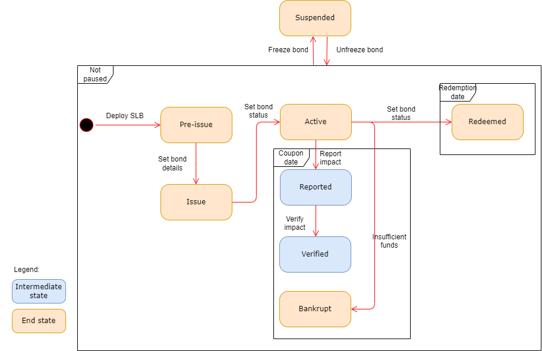

# SLB-dApp

This project was bootstrapped with [Create React App](https://github.com/facebook/create-react-app).

Link to smart contract repository: https://github.com/claryeo/slb-contracts.

## Summary

The SLB dApp is a bonds-as-a-service platform for Sustainability-Linked Bond (SLB) market participants. It utilises the synergistic benefits of blockchain, digital twin and IoT technology to create an end-to-end digital solution for activity across the SLB lifecycle.

The primary user roles are: 
    (1) Investor: Purchase bond units
    (2) Issuer: Issue bonds
    (3) Verifier: Provide KPI performance verification 
    (4) Regulator: Monitor and freeze transactions

### UML state machine diagram 



## Setup

### Requirements

Node >= [14.0.0](https://nodejs.org/en/) and npm >= 5.6

### Build

Download and clone this repository. Install dependencies.

```bash
git clone https://github.com/claryeo/slb-dapp.git
cd slb-dapp
npm install
```

### Run

```bash
npm start
```

### Transactions

- Install [MetaMask](https://metamask.io/download/) browser extension.
- Connect MetaMask to IoTeX Network (see [IoTeX documentation](https://docs.iotex.io/get-started/iotex-wallets/metamask)).
- Import wallet to MetaMask.
- Ensure that there are sufficient test IOTX tokens. Obtain tokens from https://faucet.iotex.io/.

## Available Scripts

In the project directory, you can run:

### `npm start`

Runs the app in the development mode.\
Open [http://localhost:3000](http://localhost:3000) to view it in your browser.

The page will reload when you make changes.\
You may also see any lint errors in the console.

### `npm test`

Launches the test runner in the interactive watch mode.\
See the section about [running tests](https://facebook.github.io/create-react-app/docs/running-tests) for more information.

### `npm run build`

Builds the app for production to the `build` folder.\
It correctly bundles React in production mode and optimizes the build for the best performance.

The build is minified and the filenames include the hashes.\
Your app is ready to be deployed!

See the section about [deployment](https://facebook.github.io/create-react-app/docs/deployment) for more information.

### `npm run eject`

**Note: this is a one-way operation. Once you `eject`, you can't go back!**

If you aren't satisfied with the build tool and configuration choices, you can `eject` at any time. This command will remove the single build dependency from your project.

Instead, it will copy all the configuration files and the transitive dependencies (webpack, Babel, ESLint, etc) right into your project so you have full control over them. All of the commands except `eject` will still work, but they will point to the copied scripts so you can tweak them. At this point you're on your own.

You don't have to ever use `eject`. The curated feature set is suitable for small and middle deployments, and you shouldn't feel obligated to use this feature. However we understand that this tool wouldn't be useful if you couldn't customize it when you are ready for it.


<!-- ### Code Splitting

This section has moved here: [https://facebook.github.io/create-react-app/docs/code-splitting](https://facebook.github.io/create-react-app/docs/code-splitting)

### Analyzing the Bundle Size

This section has moved here: [https://facebook.github.io/create-react-app/docs/analyzing-the-bundle-size](https://facebook.github.io/create-react-app/docs/analyzing-the-bundle-size)

### Making a Progressive Web App

This section has moved here: [https://facebook.github.io/create-react-app/docs/making-a-progressive-web-app](https://facebook.github.io/create-react-app/docs/making-a-progressive-web-app)

### Advanced Configuration

This section has moved here: [https://facebook.github.io/create-react-app/docs/advanced-configuration](https://facebook.github.io/create-react-app/docs/advanced-configuration)

### Deployment

This section has moved here: [https://facebook.github.io/create-react-app/docs/deployment](https://facebook.github.io/create-react-app/docs/deployment)

### `npm run build` fails to minify

This section has moved here: [https://facebook.github.io/create-react-app/docs/troubleshooting#npm-run-build-fails-to-minify](https://facebook.github.io/create-react-app/docs/troubleshooting#npm-run-build-fails-to-minify) -->
